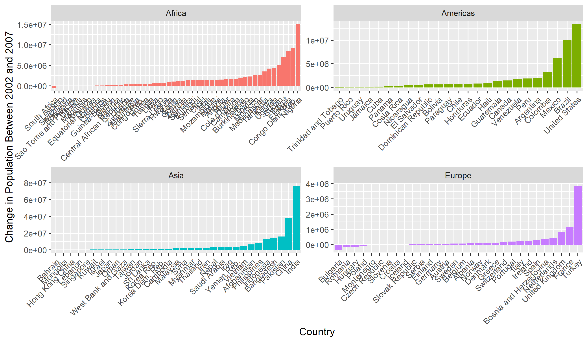

# This is a big header

## This is a smaller header

This is just some regular text.  Or some **bold** text.

```{r, include = FALSE}
knitr::opts_chunk$set(message = FALSE) 

#code is knitted from top to bottom - should run as if your code was part of one script

```


```{r}
#cmd+option+i adds a code chunk

library(tidyverse)
```

Loaded tidyverse, now we'll examine data.

```{r}
summary(storms)
str(storms)
``` 

Let's make a plot!

```{r}
storms %>% 
  ggplot (aes(x = as.factor(month), y = pressure, color = wind)) + 
  geom_jitter(alpha = 0.5)

```

[Link to the RMarkdown lesson](https://gge-ucd.github.io/R-DAVIS/lesson_rmarkdown.html)


```{r}
library(knitr)
kable(storms[1:20,], caption = "table with kable")
```

```{r}
htmlTable::htmlTable(storms[1:20,])
```

```{r}
DT::datatable(storms)
```

